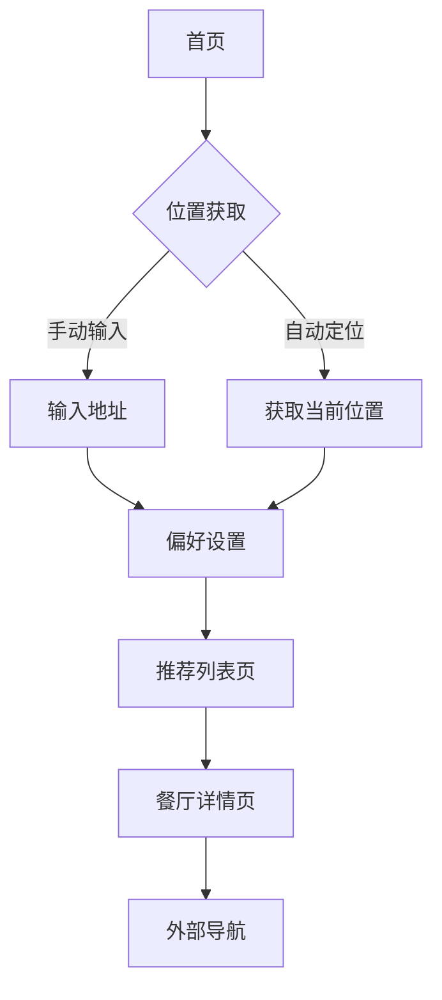

## 1. 产品概述
打工人吃饭推荐网页应用旨在解决上班族日常面临的"吃什么"选择困难问题。通过智能算法结合用户位置、口味偏好和周边餐厅信息，为用户提供个性化的餐厅推荐服务，节省选择时间，提升用餐体验。

目标用户群体为都市上班族，解决他们在工作日午餐时间的选择困扰，提供便捷、智能的用餐决策支持。

## 2. 核心功能

### 2.1 用户角色
| 角色 | 注册方式 | 核心权限 |
|------|----------|----------|
| 普通用户 | 无需注册，直接使用 | 获取餐厅推荐、设置偏好、查看餐厅详情 |

### 2.2 功能模块
吃饭推荐应用包含以下主要页面：
1. **首页**: 位置输入、自动定位、推荐按钮
2. **偏好设置页**: 口味选择、价格区间、距离范围
3. **推荐列表页**: 餐厅列表、评分显示、距离信息
4. **餐厅详情页**: 详细信息、营业时间、用户评价

### 2.3 页面详情
| 页面名称 | 模块名称 | 功能描述 |
|-----------|-------------|-------------|
| 首页 | 位置输入模块 | 输入工作地址、自动获取当前位置、地图选点 |
| 首页 | 快速推荐 | 一键获取基于当前位置的餐厅推荐 |
| 偏好设置页 | 口味偏好 | 选择菜系类型（川菜、粤菜、快餐等） |
| 偏好设置页 | 价格筛选 | 设置人均消费价格区间 |
| 偏好设置页 | 距离设置 | 设置可接受的步行或驾车距离 |
| 推荐列表页 | 餐厅卡片 | 显示餐厅名称、评分、距离、人均价格 |
| 推荐列表页 | 排序功能 | 按距离、评分、价格排序 |
| 推荐列表页 | 筛选功能 | 根据营业状态、菜系重新筛选 |
| 餐厅详情页 | 基本信息 | 展示地址、电话、营业时间 |
| 餐厅详情页 | 用户反馈 | 显示评分、评论、照片 |

## 3. 核心流程
用户操作流程：
1. 用户进入首页，选择输入位置或允许自动定位
2. 可选择设置个人偏好（口味、价格、距离）
3. 点击获取推荐，系统展示符合条件的餐厅列表
4. 用户可查看餐厅详情，获取导航信息

## 4. 用户界面设计

### 4.1 设计风格
- **主色调**: 橙色（#FF6B35）代表食欲，搭配白色背景
- **按钮样式**: 圆角矩形，橙色背景，白色文字
- **字体**: 优先使用系统默认字体，标题16px，正文14px
- **布局风格**: 卡片式布局，清晰的信息层级
- **图标风格**: 使用简洁的线性图标，符合现代设计趋势

### 4.2 页面设计概述
| 页面名称 | 模块名称 | UI元素 |
|-----------|-------------|-------------|
| 首页 | 位置输入 | 搜索框带定位图标，橙色边框，下方显示当前位置 |
| 首页 | 推荐按钮 | 大圆形按钮，橙色渐变背景，中央显示餐具图标 |
| 偏好设置页 | 口味选择 | 多选标签，选中状态橙色背景，圆角设计 |
| 推荐列表页 | 餐厅卡片 | 左侧图片，右侧信息垂直排列，包含星级评分 |
| 餐厅详情页 | 详情展示 | 顶部大图轮播，下方信息区块分明，包含地图预览 |

### 4.3 响应式设计
- 采用移动端优先设计，适配手机屏幕
- 平板设备显示两列卡片布局
- 桌面端最大宽度限制为1200px，居中显示