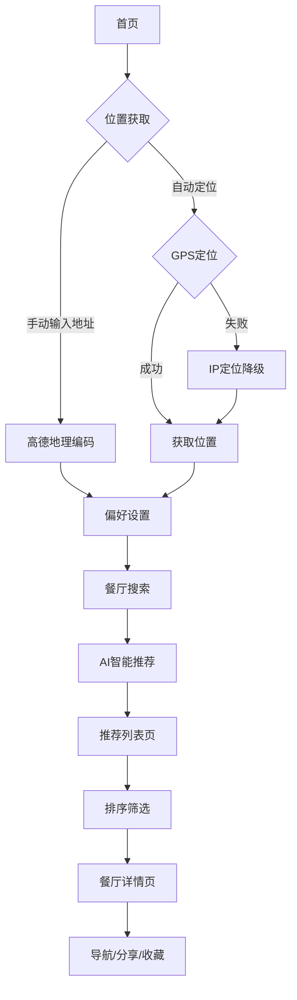

## 1. 产品概述

### 1.1 产品名称：挑食（Tiaoshi）

**品牌寓意**：
- "挑食"原指对食物挑三拣四的习惯
- 我们的产品帮你"挑剔"出最适合你的餐厅
- 反转为正面 - 我们帮你精挑细选，不再为吃什么而烦恼

**slogan**：「挑食，我们只做专业的吃饭推荐」

### 1.2 产品定位
打工人吃饭推荐网页应用旨在解决上班族日常面临的"吃什么"选择困难问题。通过智能算法结合用户位置、口味偏好和周边餐厅信息，为用户提供个性化的餐厅推荐服务，节省选择时间，提升用餐体验。

目标用户群体为都市上班族，解决他们在工作日午餐时间的选择困扰，提供便捷、智能的用餐决策支持。

## 2. 核心功能

### 2.1 用户角色
| 角色 | 注册方式 | 核心权限 |
|------|----------|----------|
| 普通用户 | 无需注册，直接使用 | 获取餐厅推荐、设置偏好、查看餐厅详情、使用导航功能 |

### 2.2 功能模块
吃饭推荐应用包含以下主要页面：
1. **首页**: 位置输入、自动定位（GPS+IP降级）、手动地址输入、快速推荐
2. **偏好设置页**: 口味选择（23种菜系）、价格区间（4级）、距离范围（500m-3km）、饮食限制
3. **推荐列表页**: 餐厅列表、智能评分、多维度排序、匹配类型标签、推荐理由展示
4. **餐厅详情页**: 详细信息、营业时间、导航功能、分享功能、收藏功能

### 2.3 技术特性
- **AI智能推荐**: 集成硅基流动AI API，提供个性化推荐（含基础算法备用方案）
- **多重定位策略**: GPS定位 → 高德地理编码 → IP定位的降级策略
- **地图服务**: 高德地图API（地理编码、逆地理编码、周边搜索、详情查询）
- **响应式设计**: 移动端优先，适配多设备屏幕尺寸

### 2.3 页面详情
| 页面名称 | 模块名称 | 功能描述 |
|-----------|-------------|-------------|
| 首页 | 自动定位 | GPS自动定位，失败时自动降级到IP定位 |
| 首页 | 手动地址输入 | 输入工作地址，调用高德地图地理编码服务解析为经纬度 |
| 首页 | 快速推荐 | 一键获取基于当前位置和偏好的智能餐厅推荐 |
| 首页 | 功能介绍 | 展示应用核心功能特点（智能定位、个性偏好、智能推荐） |
| 偏好设置页 | 菜系偏好 | 23种菜系类型多选标签（川菜、粤菜、日料、西餐等） |
| 偏好设置页 | 价格区间 | 4级价格筛选（便宜<30元、实惠30-60元、中等60-100元、高档>100元） |
| 偏好设置页 | 距离范围 | 5档距离选择（500m/1km/1.5km/2km/3km） |
| 偏好设置页 | 饮食限制 | 5种特殊饮食需求（素食、清真、无辣、少油、少盐） |
| 偏好设置页 | 偏好持久化 | 自动保存用户偏好，下次进入自动加载 |
| 推荐列表页 | 餐厅卡片 | 展示餐厅名称、评分、距离、价格等级、营业状态、电话 |
| 推荐列表页 | 智能评分 | AI算法计算推荐分数（0-100分），圆形可视化展示 |
| 推荐列表页 | 排序功能 | 三维度排序（智能评分、距离最近、评分最高） |
| 推荐列表页 | 匹配标签 | 显示匹配类型（完美匹配/不错选择/还可以）彩色标签 |
| 推荐列表页 | 推荐理由 | 展示多条推荐理由标签（如"距离很近、评分很高、价格合适"） |
| 餐厅详情页 | 基本信息 | 名称、地址、电话、菜系、评分、价格等级、营业状态 |
| 餐厅详情页 | 营业时间 | 营业时间段展示，营业中/已打烊状态清晰标识 |
| 餐厅详情页 | 导航功能 | 一键调用高德地图网页版导航，支持步行模式 |
| 餐厅详情页 | 分享功能 | 支持原生分享API或复制链接到剪贴板 |
| 餐厅详情页 | 收藏功能 | 收藏/取消收藏餐厅（本地状态） |

## 3. 核心流程
用户操作流程：
1. 用户进入首页，选择自动定位（GPS优先，失败自动降级IP）或手动输入地址
2. 可选择设置个人偏好（菜系、价格、距离、饮食限制）
3. 点击快速推荐，系统调用AI算法生成推荐结果
4. 浏览推荐列表，可排序查看（智能评分/距离/评分）
5. 点击餐厅卡片查看详情，使用导航功能前往餐厅
6. 可分享餐厅链接给朋友，或收藏餐厅



## 4. 用户界面设计

### 4.1 设计风格
- **主色调**: 橙色渐变（#fb923c 到 #f97316），搭配白色背景和灰色辅助色
- **按钮样式**:
  - 主要按钮：橙色渐变背景，白色文字，圆角矩形
  - 次要按钮：灰色背景，hover状态加深
  - 圆形评分：渐变背景，白色数字，环形展示
- **字体**: 系统默认字体，标题18-24px，正文14-16px
- **布局风格**: 卡片式布局，清晰信息层级，充足留白
- **图标**: 使用Lucide React线性图标库，简洁现代
- **交互反馈**: hover状态、过渡动画、加载状态、禁用状态

### 4.2 页面设计概述
| 页面名称 | 模块名称 | UI元素 |
|-----------|-------------|-------------|
| 首页 | 位置获取区域 | 白色卡片，橙色标题，包含自动定位按钮和手动输入框 |
| 首页 | 快速推荐按钮 | 大尺寸圆形按钮，从橙色到黄色的渐变背景，中央餐具图标 |
| 首页 | 当前位置展示 | 绿色背景卡片，显示解析后的地址或经纬度 |
| 首页 | 功能介绍 | 三栏卡片布局，图标+标题+简介，橙色图标背景 |
| 偏好设置页 | 菜系选择 | 3-4列网格布局，多选标签，选中状态橙色背景+边框 |
| 偏好设置页 | 价格区间 | 复选框列表，不同价格等级用不同颜色标识 |
| 偏好设置页 | 距离选择 | 2-3列网格布局，单选按钮样式，选中状态橙色背景 |
| 偏好设置页 | 饮食限制 | 复选框垂直列表，清晰易读 |
| 推荐列表页 | 餐厅卡片 | 白色圆角卡片，hover阴影效果，包含餐厅信息和推荐分 |
| 推荐列表页 | 智能评分 | 圆形进度条样式，渐变背景，大字号白色数字 |
| 推荐列表页 | 匹配标签 | 彩色圆角标签（绿/蓝/灰），文字说明匹配程度 |
| 推荐列表页 | 推荐理由 | 橙色半透明标签，展示多条推荐理由 |
| 餐厅详情页 | 头部导航 | 返回按钮+收藏分享按钮，sticky定位 |
| 餐厅详情页 | 图片区域 | 渐变背景占位图，餐具图标居中 |
| 餐厅详情页 | 信息卡片 | 白色卡片，大标题+评分+价格，下划线分隔 |
| 餐厅详情页 | 操作按钮 | 全宽橙色按钮，导航图标，明显可点击 |

### 4.3 响应式设计
- **移动端优先**: 默认单列布局，适合手机竖屏
- **平板端**: 偏好设置页显示2-3列，推荐列表保持单列
- **桌面端**: 最大宽度1200px居中，适当增加padding和间距
- **图片适配**: 使用占位图和渐变背景，避免真实图片加载问题
- **字体缩放**: 根据屏幕尺寸适当调整字体大小，保证可读性

### 4.4 交互设计
- **加载状态**: 全屏居中加载动画，橙色spinner
- **错误反馈**: 红色背景卡片，清晰错误信息
- **成功反馈**: 绿色背景卡片，确认操作成功
- **空状态**: 灰色图标+文字说明，引导用户操作
- **按钮禁用**: 半透明+不可点击状态，避免误操作
- **过渡动画**: 卡片hover效果、按钮点击反馈、页面切换

## 5. 技术架构

### 5.1 前端技术栈
- **框架**: React 18 + TypeScript
- **构建工具**: Vite 6
- **样式方案**: Tailwind CSS
- **状态管理**: Zustand（轻量级，支持持久化）
- **路由**: React Router DOM
- **图标库**: Lucide React
- **代码规范**: ESLint + 宽松TypeScript配置

### 5.2 API集成
| API服务 | 用途 | 端点示例 |
|---------|------|----------|
| 高德地图API | 地理编码、逆地理编码、周边搜索、详情查询 | `/v5/place/around`, `/v3/geocode/geo` |
| 硅基流动API | AI智能推荐 | `https://api.siliconflow.cn/v1/chat/completions` |
| IP定位服务 | IP定位降级方案 | `http://ip-api.com/json` |

### 5.3 状态管理设计
全局状态（Zustand）：
- `currentLocation`: 当前位置（含经纬度、地址）
- `preferences`: 用户偏好设置（持久化存储）
- `restaurants`: 搜索到的餐厅列表
- `recommendations`: AI生成的推荐结果
- `loading状态`: 位置获取、餐厅搜索、推荐生成

### 5.4 智能推荐算法

#### AI推荐算法（硅基流动）
- **模型**: Qwen/Qwen2.5-7B-Instruct
- **输入**: 用户偏好、位置信息、餐厅数据
- **输出**: 推荐结果（含分数、理由、匹配类型）
- **评分维度**: 偏好匹配度、距离、评分、价格、营业时间
- **容错机制**: API失败时自动切换基础算法

#### 基础推荐算法（备用）
- **距离评分**: 0-30分（距离越近分数越高）
- **评分权重**: 0-25分（餐厅评分×5）
- **价格匹配**: 0-20分（价格在偏好范围内满分）
- **菜系匹配**: 0-15分（菜系偏好匹配）
- **营业状态**: 10分（营业中加分）
- **返回数量**: 前5名，按分数降序排序

### 5.5 定位服务策略
1. **GPS定位**: `navigator.geolocation.getCurrentPosition()`
2. **地址解析**: 调用高德地图地理编码API
3. **IP定位降级**: `ip-api.com`（GPS失败时使用）
4. **位置缓存**: 当前位置信息存储在全局状态中

### 5.6 数据流
```
用户操作 → 页面组件 → Hook（自定义逻辑） → 服务层（API调用） → 更新全局状态 → 组件重新渲染
```

## 6. 非功能性需求

### 6.1 性能要求
- 页面首次加载时间 ≤ 3秒
- API响应时间 ≤ 5秒（含AI推荐）
- 客户端渲染流畅，无卡顿
- 支持现代浏览器代码分割和懒加载

### 6.2 兼容性
- **浏览器**: Chrome 80+、Safari 13+、Firefox 75+、Edge 80+
- **移动端**: iOS 12+、Android 8+
- **响应式**: 适配320px-1200px屏幕宽度

### 6.3 安全性
- API密钥通过环境变量注入（`.env`文件）
- 高德地图API支持签名验证（可选）
- 用户位置信息仅用于实时推荐，不存储到服务器
- 本地存储仅包含用户偏好设置

### 6.4 可用性
- **错误处理**: 位置获取失败、API调用失败都有降级方案和友好提示
- **加载状态**: 所有异步操作都有加载动画
- **空状态**: 无推荐结果时提供重新获取入口
- **网络适配**: 弱网环境下优先使用备用算法

### 6.5 可维护性
- 模块化代码结构（组件、Hook、服务、状态管理分离）
- TypeScript类型定义（宽松模式）
- 清晰的API调用封装和错误处理
- 统一的UI组件风格（卡片、按钮、标签）

## 7. 已实现的特性总结

### 7.1 核心功能 ✅
- 位置获取（GPS + 手动输入 + IP降级）
- 偏好设置（23种菜系、4级价格、5档距离、5种饮食限制）
- 智能推荐（AI算法 + 基础算法）
- 餐厅列表（排序、评分、距离、价格）
- 餐厅详情（信息展示、导航、分享、收藏）

### 7.2 增强功能 ✅
- 推荐理由展示（详细解释为何推荐）
- 匹配类型标签（完美/不错/还可以）
- 多维度排序（智能分/距离/评分）
- 偏好持久化（自动保存和加载）
- 一键导航（高德地图集成）

### 7.3 尚待实现的功能
1. 地图选点功能（PRD中有，代码未实现）
2. 用户评价体系（评论、打分、上传照片）
3. 筛选功能（营业状态筛选、菜系筛选）
4. 历史记录（查看之前的推荐和选择）
5. 用户账户系统（同步偏好跨设备）