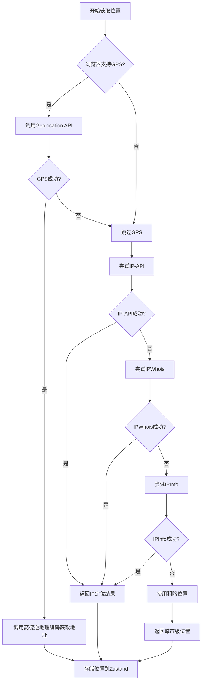
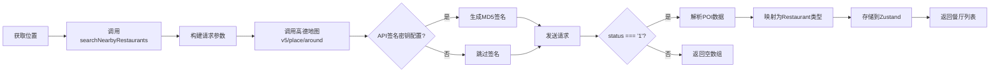
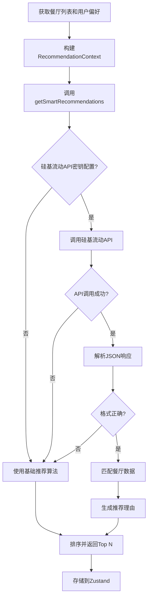
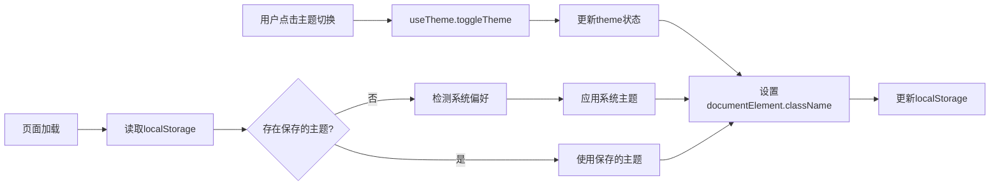

## 1. 架构设计

```mermaid
graph TD
  A[用户浏览器] --> B[React前端应用]
  B --> C[高德地图API]
  B --> D[硅基流动API]
  B --> E[IP定位服务
(ip-api/ipwhois/ipinfo)]

  subgraph "前端层"
    B
  end

  subgraph "第三方服务层"
    C
    D
    E
  end
```

## 2. 技术栈描述

- **前端框架**: React 18.3 + TypeScript 5.x
- **构建工具**: Vite 6.x
- **状态管理**: Zustand 5.x (带持久化中间件)
- **样式方案**: Tailwind CSS 3.4 + tailwind-merge + clsx
- **地图服务**: 高德地图API (地理位置、周边搜索)
- **AI服务**: 硅基流动API (MiniMax-M2模型)
- **图标库**: Lucide React
- **代码质量**: ESLint 9 + TypeScript + Husky + lint-staged
- **路由**: React Router DOM 7.x

## 3. 路由定义

| 路由 | 用途 | 组件 |
|-------|---------|---------|
| `/` | 首页，位置输入和快速推荐 | `src/pages/Home.tsx` |
| `/preferences` | 偏好设置页面，配置个人口味偏好 | `src/pages/Preferences.tsx` |
| `/recommendations` | 推荐列表页面，展示餐厅推荐结果 | `src/pages/Recommendations.tsx` |
| `/restaurant/:id` | 餐厅详情页面，显示具体餐厅信息 | `src/pages/RestaurantDetail.tsx` |

### 3.1 路由结构
```typescript
// src/App.tsx
<Router>
  <Routes>
    <Route path="/" element={<Home />} />
    <Route path="/preferences" element={<Preferences />} />
    <Route path="/recommendations" element={<Recommendations />} />
    <Route path="/restaurant/:id" element={<RestaurantDetail />} />
  </Routes>
</Router>
```

## 4. API服务层

项目采用直接调用第三方服务的架构，没有自建后端API服务。

### 4.1 位置服务 (`src/services/location.ts`)

**接口定义**
```typescript
export interface Location {
  latitude: number
  longitude: number
  address?: string
}
```

**核心函数**
- `getCurrentLocation()` - 使用浏览器Geolocation API获取GPS坐标
- `getAddressFromCoordinates(lat, lng)` - 调用高德地图逆地理编码API获取地址
- `getCoordinatesFromAddress(address)` - 调用高德地图地理编码API获取坐标
- `calculateDistance(lat1, lng1, lat2, lng2)` - 使用Haversine公式计算两点距离（米）

**API签名认证**
- 可选的MD5签名生成（用于高德API）
- 需要 `VITE_AMAP_SIG_SECRET` 环境变量

### 4.2 IP定位服务 (`src/services/ipLocation.ts`)

**核心函数**
- `getLocationByIP()` - 依次尝试多个IP定位服务（ip-api → ipwhois → ipinfo）
- `getApproximateLocation()` - 获取粗略位置（城市级别，隐私友好）
- `getUserIP()` - 获取用户公共IP地址

**降级策略**
- 依次尝试多个服务商，任一成功即返回
- 全部失败后返回默认位置（北京）

### 4.3 餐厅服务 (`src/services/restaurant.ts`)

**数据类型**
```typescript
export interface Restaurant {
  id: string              // 餐厅ID（来自高德API）
  name: string            // 餐厅名称
  address: string         // 详细地址
  phone?: string          // 联系电话
  latitude: number        // 纬度
  longitude: number       // 经度
  category: string        // 分类/菜系
  rating: number          // 评分（0-5）
  priceLevel: number      // 价格等级（1-4）
  isOpen: boolean         // 营业状态
  openingHours?: string   // 营业时间
  photos?: string[]       // 照片URL
  distance?: number       // 距离用户的米数
}
```

**核心函数**
- `searchNearbyRestaurants(params)` - 调用高德地图v5/place/around搜索周边餐厅
- `getRestaurantDetail(id)` - 调用高德地图v5/place/detail获取餐厅详情
- `getRestaurantOpenStatus(openingHours)` - 解析营业时间判断营业状态
- `filterRestaurantsByPreferences(restaurants, preferences)` - 基于偏好筛选餐厅

### 4.4 智能推荐服务 (`src/services/recommendation.ts`)

**数据类型**
```typescript
export interface UserPreferences {
  cuisineTypes: string[]           // 偏好菜系
  priceRange: [number, number]     // 价格区间 [min, max]
  maxDistance: number              // 最大距离（米）
  dietaryRestrictions?: string[]   // 饮食限制
  preferredTime?: string           // 用餐时间
}

export interface RecommendationContext {
  location: { latitude: number, longitude: number }
  preferences: UserPreferences
  weather?: string                  // 天气信息（预留）
  timeOfDay?: string                // 时间段
  preferredTime?: string            // 用餐时间
  previousChoices?: string[]        // 历史选择（预留）
}

export interface Recommendation {
  restaurant: Restaurant           // 餐厅数据
  score: number                    // 推荐分数 (0-100)
  reasons: string[]                // 推荐理由
  matchType: 'perfect' | 'good' | 'fair'  // 匹配类型
}
```

**核心函数**
- `getSmartRecommendations(context, restaurants)` - 调用硅基流动API获取AI推荐
- `getBasicRecommendations(context, restaurants)` - 备用基础推荐算法
- `getRecommendationExplanation(recommendation)` - 生成推荐说明

**AI推荐配置**
```typescript
{
  model: 'MiniMaxAI/MiniMax-M2',
  temperature: 0.7,
  max_tokens: 100000,
  response_format: { type: 'json_object' }
}
```

**基础算法评分标准**
- 距离评分 (0-30分): 距离越近分数越高
- 评分评分 (0-25分): 餐厅评分越高分数越高
- 价格匹配 (0-20分): 符合用户价格区间得满分
- 菜系匹配 (0-15分): 匹配偏好菜系
- 营业状态 (10分): 正在营业额外加分

**降级机制**
- API密钥未配置 → 使用基础算法
- API调用失败 → 使用基础算法
- API响应格式错误 → 使用基础算法

### 4.5 环境变量配置

创建 `.env` 文件：
```bash
# 高德地图API（必需）
VITE_AMAP_API_KEY=你的高德地图API密钥

# 硅基流动API（必需）
VITE_SILICON_API_KEY=你的硅基流动API密钥

# 高德地图签名密钥（可选，用于生产环境安全增强）
VITE_AMAP_SIG_SECRET=你的签名密钥
```

## 5. 状态管理

### 5.1 Zustand Store (`src/store/index.ts`)

**状态结构**
```typescript
interface AppState {
  // 位置信息
  currentLocation: Location | null
  isLocating: boolean
  locationError: string | null

  // 用户偏好（持久化）
  preferences: UserPreferences

  // 餐厅数据
  restaurants: Restaurant[]
  isLoadingRestaurants: boolean

  // 推荐结果
  recommendations: Recommendation[]
  isGeneratingRecommendations: boolean

  // 动作方法
  setLocation: (location: Location) => void
  setLocating: (isLocating: boolean) => void
  setLocationError: (error: string | null) => void
  updatePreferences: (preferences: Partial<UserPreferences>) => void
  setRestaurants: (restaurants: Restaurant[]) => void
  setLoadingRestaurants: (isLoading: boolean) => void
  setRecommendations: (recommendations: Recommendation[]) => void
  setGeneratingRecommendations: (isGenerating: boolean) => void
  clearError: () => void
}
```

**持久化配置**
```typescript
export const useAppStore = create<AppState>()(
  persist(
    (set, get) => ({
      // 初始状态和方法定义...
    }),
    {
      name: 'lunch-recommend-app',
      partialize: (state) => ({
        // 只持久化偏好设置
        preferences: state.preferences
      })
    }
  )
)
```

**选择器Hook**
```typescript
export const useLocation = () => useAppStore((state) => state.currentLocation)
export const useIsLocating = () => useAppStore((state) => state.isLocating)
export const useLocationError = () => useAppStore((state) => state.locationError)
export const usePreferences = () => useAppStore((state) => state.preferences)
export const useRestaurants = () => useAppStore((state) => state.restaurants)
export const useIsLoadingRestaurants = () => useAppStore((state) => state.isLoadingRestaurants)
export const useRecommendations = () => useAppStore((state) => state.recommendations)
export const useIsGeneratingRecommendations = () => useAppStore((state) => state.isGeneratingRecommendations)
```

### 5.2 主题管理 (`src/hooks/useTheme.ts`)

**功能**
- 支持深色/浅色模式切换
- 自动检测系统偏好
- 持久化到localStorage

**API**
```typescript
const { theme, toggleTheme, isDark } = useTheme()
```

## 6. 自定义Hook

### 6.1 位置Hook (`src/hooks/useLocation.ts`)

**API**
```typescript
const {
  location,              // 当前位置
  isLocating,            // 是否正在定位
  locationError,         // 错误信息
  fetchCurrentLocation,  // 获取当前位置（多级降级）
  fetchLocationByIP,     // 仅IP定位
  setManualLocation,     // 手动设置位置
  geocodeAddress         // 地址解析
} = useLocation()
```

### 6.2 餐厅Hook (`src/hooks/useRestaurants.ts`)

**API**
```typescript
const {
  restaurants,                    // 餐厅列表
  isLoadingRestaurants,          // 是否加载中
  recommendations,                // 推荐结果
  isGeneratingRecommendations,   // 是否生成推荐中
  searchNearby,                   // 搜索周边餐厅
  getRecommendations,            // 获取智能推荐
  filterByPreferences,           // 根据偏好筛选
  updatePreferences,             // 更新偏好
  preferences                    // 当前偏好
} = useRestaurants()
```

## 7. 工具函数

### 7.1 样式工具 (`src/lib/utils.ts`)

```typescript
// 合并Tailwind类名，处理冲突
export function cn(...inputs: ClassValue[])
```

**使用示例**
```typescript
<button className={cn(
  'px-4 py-2 rounded',
  isPrimary && 'bg-blue-500 text-white',
  isLarge && 'px-6 py-3'
)}>
```

## 8. 数据流设计

### 8.1 位置获取流程（多级降级策略）



**详细流程**
1. **GPS定位（第一优先级）**
   - 调用浏览器Geolocation API
   - 高精度模式，超时10秒
   - 成功则调用高德逆地理编码获取详细地址
   - 失败则降级到IP定位

2. **IP定位（第二优先级）**
   - 依次尝试多个IP定位服务：IP-API → IPWhois → IPInfo
   - 任一服务成功即返回结果
   - 全部失败后继续降级

3. **粗略定位（最终降级）**
   - 调用ipapi.co获取城市级位置
   - 返回大致坐标（默认北京作为fallback）

4. **存储位置信息**
   - 存储到Zustand状态管理
   - 触发餐厅搜索和推荐流程

### 8.2 餐厅搜索流程



### 8.3 智能推荐流程



**降级机制**
```typescript
// recommendation.ts
if (!apiKey) {
  console.warn('API密钥未配置，使用基础推荐算法')
  return getBasicRecommendations(context, restaurants)
}

try {
  const data = await callSiliconAPI()
  if (success) return processAIRecommendations(data)
  else return getBasicRecommendations(context, restaurants) // 降级
} catch (error) {
  console.error('AI推荐失败:', error)
  return getBasicRecommendations(context, restaurants) // 降级
}
```

### 8.4 状态管理流程

```mermaid
graph TD
    A[React组件] --> B[调用Hook]
    B --> C[useAppStore(Zustand)]
    C --> D[内存状态]
    D --> E[persist中间件]
    E --> F[localStorage]
    G[其他组件] --> C
    H[服务层] --> C
```

**状态更新机制**
1. UI事件触发（点击、输入等）
2. 调用Zustand的set方法更新状态
3. 状态实时同步到所有订阅组件
4. persist中间件自动同步到localStorage
5. 页面刷新时从localStorage恢复状态

### 8.5 主题切换流程



## 9. 开发和部署

### 9.1 项目结构

```
src/
├── components/          # 可复用UI组件
│   └── Empty.tsx       # 空状态组件
├── hooks/              # 自定义Hook
│   ├── useLocation.ts  # 位置获取Hook
│   ├── useRestaurants.ts # 餐厅推荐Hook
│   └── useTheme.ts     # 主题切换Hook
├── pages/              # 页面组件
│   ├── Home.tsx        # 首页
│   ├── Preferences.tsx # 偏好设置
│   ├── Recommendations.tsx # 推荐列表
│   └── RestaurantDetail.tsx # 餐厅详情
├── services/           # API服务层
│   ├── location.ts     # 位置服务
│   ├── restaurant.ts   # 餐厅服务
│   ├── recommendation.ts # 推荐服务
│   └── ipLocation.ts   # IP定位服务
├── store/              # 状态管理
│   └── index.ts        # Zustand store
├── lib/                # 工具函数
│   └── utils.ts        # 通用工具（cn样式合并）
├── main.tsx            # 应用入口
└── App.tsx             # 路由配置
```

### 9.2 开发环境配置

**依赖版本要求**
- Node.js 16+
- pnpm 8+
- TypeScript 5.8

**环境变量配置**
创建 `.env` 文件：
```bash
# 高德地图API（必需）
VITE_AMAP_API_KEY=你的高德地图API密钥

# 硅基流动API（必需）
VITE_SILICON_API_KEY=你的硅基流动API密钥

# 高德地图签名密钥（可选，用于生产环境安全增强）
VITE_AMAP_SIG_SECRET=你的签名密钥
```

**获取API密钥**
- 高德地图：https://console.amap.com/（需要实名认证）
- 硅基流动：https://cloud.siliconflow.cn/

**开发命令**
```bash
# 安装依赖
pnpm install

# 启动开发服务器（带HMR）
pnpm dev

# 运行类型检查（宽松模式）
pnpm run check

# 运行类型检查（严格模式）
pnpm run check:strict

# 运行ESLint检查
pnpm run lint

# 完整验证（严格类型检查 + ESLint）
pnpm run validate

# 构建生产版本
pnpm run build

# 预览生产构建
pnpm run preview
```

**提交前自动检查**（Husky + lint-staged）
```bash
# pre-commit钩子会自动执行：
# 1. TypeScript严格类型检查
# 2. ESLint修复
```

### 9.3 TypeScript配置

**宽松模式** (`tsconfig.json`)
```json
{
  "compilerOptions": {
    "strict": false,                    // 关闭严格模式
    "noUnusedLocals": false,            // 允许未使用的局部变量
    "noUnusedParameters": false,        // 允许未使用的参数
    "noFallthroughCasesInSwitch": false,
    "noUncheckedSideEffectImports": false,
    "forceConsistentCasingInFileNames": false,
    "skipLibCheck": true                // 跳过库文件检查
  }
}
```

**严格模式** (`tsconfig.strict.json`)
```json
{
  "extends": "./tsconfig.json",
  "compilerOptions": {
    "strict": true,
    "noUnusedLocals": true,
    "noUnusedParameters": true
  }
}
```

### 9.4 构建和部署

**生产构建输出**
```bash
pnpm run build
# 输出到 dist/ 目录
```

**Vercel部署配置** (`vercel.json`)
```json
{
  "rewrites": [
    {
      "source": "/(.*)",
      "destination": "/index.html"
    }
  ]
}
```

**部署前检查清单**
- [ ] 创建 `.env.production` 文件并配置API密钥
- [ ] 运行 `pnpm run validate` 确保没有错误
- [ ] 运行 `pnpm run build` 确保构建成功
- [ ] 测试生产构建 `pnpm run preview`

## 10. 关键功能详解

### 10.1 位置获取的多级降级策略

**策略优势**
1. **GPS定位** - 精度高（米级），但需要用户授权
2. **IP定位** - 无需授权，精度中等（城市级）
3. **粗略定位** - 作为最终Fallback，确保功能可用

**错误处理**
- 每个级别都有独立的错误捕获
- 失败后自动降级到下一个级别
- 最终提供友好的错误提示

**隐私考虑**
- 提供IP定位选项（不暴露精确位置）
- 所有位置数据仅存储在客户端
- 不收集或上传位置历史

### 10.2 智能推荐的双层架构

**AI推荐层**（主）
- 使用硅基流动MiniMax-M2模型
- 输入：餐厅列表 + 用户偏好 + 位置信息
- 输出：个性化推荐理由和评分

**基础算法层**（备用）
- 无需AI，纯前端计算
- 评分维度：距离、评分、价格、菜系、营业时间
- 确保API密钥失效时仍可正常使用

### 10.3 状态管理的持久化

**实现机制**
```typescript
// Zustand的persist中间件自动处理：
1. 状态变更时自动序列化并写入localStorage
2. 页面加载时从localStorage反序列化并恢复状态
3. 可选择性持久化（只保存preferences）
```

**优势**
- 无需手动操作localStorage
- 刷新页面后用户偏好不丢失
- 与其他状态统一管理
- 支持时间旅行调试（配合devtools）

## 11. 性能优化（未来规划）

### 11.1 实现Service Worker缓存
```typescript
// 缓存API响应，减少重复请求
const restaurantCache = new CacheAPI('restaurants-v1')
const recommendationCache = new CacheAPI('recommendations-v1')
```

### 11.2 虚拟滚动优化长列表
```typescript
// 推荐列表可能很长，使用虚拟滚动优化性能
import { FixedSizeList } from 'react-window'
<FixedSizeList height={600} itemCount={recommendations.length} itemSize={200}>
  {Row}
</FixedSizeList>
```

### 11.3 图片懒加载
```typescript
// 餐厅图片使用懒加载

```

### 11.4 Bundle拆分
```typescript
// 路由级code splitting
const RestaurantDetail = lazy(() => import('./pages/RestaurantDetail'))
```

## 12. 安全考虑

### 12.1 API密钥保护
- 仅限前端使用的API密钥（高德、硅基流动）
- 使用VITE_前缀的环境变量
- 考虑实现API签名认证（VITE_AMAP_SIG_SECRET）

### 12.2 用户隐私
- 位置数据不上传服务器
- 不提供用户追踪功能
- 明确告知位置使用目的

### 12.3 输入验证
- 地址输入需要验证（防止XSS）
- API响应需要校验（防止XSS和数据注入）

## 13. 浏览器兼容性

**支持浏览器**
- Chrome 88+
- Firefox 85+
- Safari 14+
- Edge 88+

**必需特性**
- ES2020
- Geolocation API（或降级到IP定位）
- Fetch API
- localStorage

## 14. 故障排查

### 常见问题

**位置获取失败**
- 检查浏览器是否授予地理位置权限
- 确认使用HTTPS协议（Geolocation API要求）
- 尝试使用IP定位方式

**餐厅搜索无结果**
- 检查高德地图API密钥是否有效
- 确认位置坐标是否正确
- 尝试扩大搜索半径

**推荐生成失败**
- 检查硅基流动API密钥是否有效
- 查看控制台错误信息
- 确认网络连接正常
- 自动降级使用基础推荐算法

**构建错误**
- 运行 `pnpm run check` 查看TypeScript错误
- 运行 `pnpm run lint` 查看ESLint错误
- 检查环境变量是否正确配置
