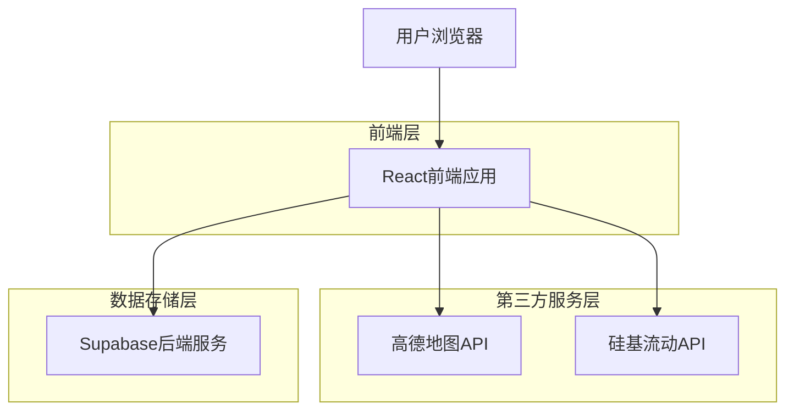
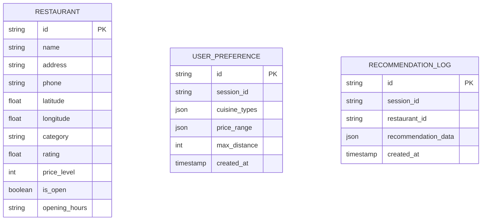

## 1. 架构设计



## 2. 技术栈描述

- **前端**: React@18 + TypeScript@5 + Tailwind CSS@3 + Vite@5
- **后端**: Supabase (PostgreSQL数据库 + 认证服务)
- **地图服务**: 高德地图API (地理位置、周边搜索)
- **AI服务**: 硅基流动API (智能推荐算法)

## 3. 路由定义

| 路由 | 用途 |
|-------|---------|
| / | 首页，位置输入和快速推荐 |
| /preferences | 偏好设置页面，配置个人口味偏好 |
| /recommendations | 推荐列表页面，展示餐厅推荐结果 |
| /restaurant/:id | 餐厅详情页面，显示具体餐厅信息 |

## 4. API定义

### 4.1 核心API接口

**获取地理位置**
```
GET /api/location/current
```

响应:
| 参数名 | 参数类型 | 描述 |
|-----------|-------------|-------------|
| latitude | number | 纬度坐标 |
| longitude | number | 经度坐标 |
| address | string | 详细地址 |

**获取周边餐厅**
```
GET /api/restaurants/nearby
```

请求参数:
| 参数名 | 参数类型 | 是否必需 | 描述 |
|-----------|-------------|-------------|-------------|
| lat | number | true | 纬度 |
| lng | number | true | 经度 |
| radius | number | false | 搜索半径(米) |
| keywords | string | false | 搜索关键词 |

**智能推荐**
```
POST /api/recommendations/smart
```

请求体:
| 参数名 | 参数类型 | 是否必需 | 描述 |
|-----------|-------------|-------------|-------------|
| location | object | true | 位置信息 {lat, lng} |
| preferences | object | false | 用户偏好设置 |
| budget | object | false | 价格区间 {min, max} |

## 5. 数据模型

### 5.1 数据库实体设计



### 5.2 数据定义语言

**餐厅表 (restaurants)**
```sql
-- 创建餐厅表
CREATE TABLE restaurants (
  id UUID PRIMARY KEY DEFAULT gen_random_uuid(),
  name VARCHAR(255) NOT NULL,
  address TEXT NOT NULL,
  phone VARCHAR(20),
  latitude DECIMAL(10, 8) NOT NULL,
  longitude DECIMAL(11, 8) NOT NULL,
  category VARCHAR(100),
  rating DECIMAL(2, 1) DEFAULT 0,
  price_level INTEGER CHECK (price_level >= 1 AND price_level <= 4),
  is_open BOOLEAN DEFAULT true,
  opening_hours TEXT,
  created_at TIMESTAMP WITH TIME ZONE DEFAULT NOW()
);

-- 创建空间索引
CREATE INDEX idx_restaurants_location ON restaurants(latitude, longitude);
CREATE INDEX idx_restaurants_rating ON restaurants(rating DESC);
```

**用户偏好表 (user_preferences)**
```sql
-- 创建用户偏好表
CREATE TABLE user_preferences (
  id UUID PRIMARY KEY DEFAULT gen_random_uuid(),
  session_id VARCHAR(255) UNIQUE NOT NULL,
  cuisine_types JSONB DEFAULT '[]',
  price_range JSONB DEFAULT '{"min": 0, "max": 100}',
  max_distance INTEGER DEFAULT 1000,
  created_at TIMESTAMP WITH TIME ZONE DEFAULT NOW(),
  updated_at TIMESTAMP WITH TIME ZONE DEFAULT NOW()
);

-- 创建会话索引
CREATE INDEX idx_user_preferences_session ON user_preferences(session_id);
```

**推荐记录表 (recommendation_logs)**
```sql
-- 创建推荐记录表
CREATE TABLE recommendation_logs (
  id UUID PRIMARY KEY DEFAULT gen_random_uuid(),
  session_id VARCHAR(255) NOT NULL,
  restaurant_id UUID REFERENCES restaurants(id),
  recommendation_data JSONB,
  created_at TIMESTAMP WITH TIME ZONE DEFAULT NOW()
);

-- 创建查询索引
CREATE INDEX idx_recommendation_session ON recommendation_logs(session_id);
CREATE INDEX idx_recommendation_created ON recommendation_logs(created_at DESC);
```

### 5.3 权限设置
```sql
-- 匿名用户权限
GRANT SELECT ON restaurants TO anon;
GRANT SELECT, INSERT, UPDATE ON user_preferences TO anon;
GRANT SELECT, INSERT ON recommendation_logs TO anon;

-- 认证用户权限
GRANT ALL PRIVILEGES ON restaurants TO authenticated;
GRANT ALL PRIVILEGES ON user_preferences TO authenticated;
GRANT ALL PRIVILEGES ON recommendation_logs TO authenticated;
```

## 6. 数据流设计

### 6.1 位置获取流程
1. 前端通过Geolocation API获取用户坐标
2. 调用高德地图逆地理编码API获取详细地址
3. 将位置信息存储到本地状态管理
4. 基于位置获取周边餐厅数据

### 6.2 推荐算法流程
1. 收集用户偏好设置和位置信息
2. 调用高德API获取周边餐厅基础数据
3. 通过硅基流动API进行智能筛选和排序
4. 结合用户历史行为数据优化推荐结果
5. 返回个性化餐厅推荐列表

### 6.3 缓存策略
- 餐厅基础数据缓存24小时
- 用户偏好设置缓存当前会话
- 推荐结果缓存1小时
- 使用浏览器本地存储保存常用设置